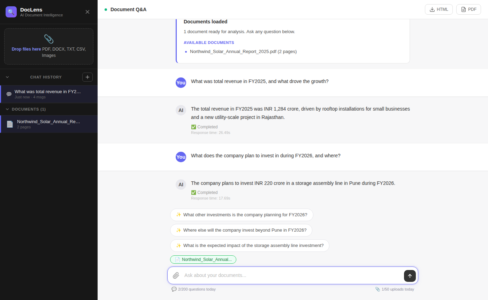
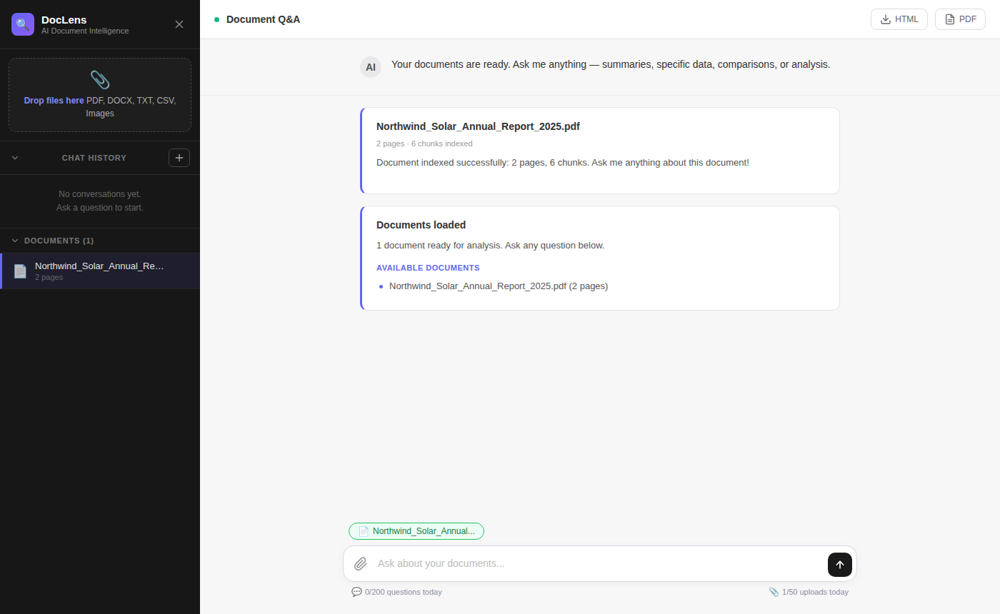
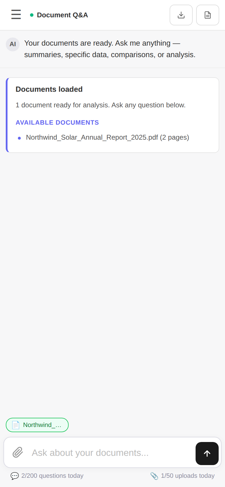
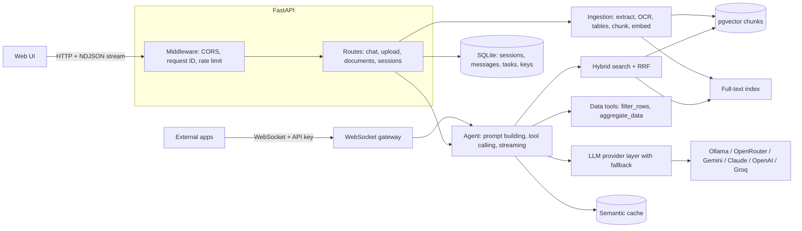

# DocLens

**An AI document analysis engine.** Upload PDFs, Word files, spreadsheets or scanned images, then ask questions in plain language. DocLens retrieves the relevant passages with hybrid search, lets the LLM call data tools for exact answers on tables, and streams a grounded answer with its sources back to a web UI or to any app over WebSocket.

It runs fully locally (Ollama, LM Studio) or with any cloud LLM: OpenRouter, Google Gemini, Anthropic Claude, OpenAI, Groq, or any OpenAI-compatible endpoint. Switching providers is a `.env` change; no code changes.




<table>
<tr>
<td width="68%"></td>
<td width="32%"></td>
</tr>
<tr>
<td><sub>Upload: the document is extracted, chunked and indexed in the background.</sub></td>
<td><sub>Responsive layout on a phone.</sub></td>
</tr>
</table>

<sub>Screenshots use a fictional sample report, <a href="samples/Northwind_Solar_Annual_Report_2025.pdf">samples/Northwind_Solar_Annual_Report_2025.pdf</a>, with the local <code>qwen3</code> model via Ollama. Try it with the same file.</sub>

---

## Features

**Retrieval-Augmented Generation (RAG)**
- Ingests **PDF, DOCX, TXT, CSV and images**. PyMuPDF for native text, with **Tesseract OCR** fallback for scanned pages (OCR results are cached).
- **Table extraction** from PDFs into CSV, so tables can be queried exactly rather than guessed from text. Three detection strategies run on each PDF; tables with drawn grid lines are preferred, and the rest are compared after cleaning.
- Overlapping chunks (500 characters, 100 overlap) with source and page metadata.
- Embeddings with `nomic-embed-text` (768 dimensions, via local Ollama) stored in **PostgreSQL + pgvector**.
- **Hybrid search:** semantic vector search and Postgres **full-text** keyword search, merged with **Reciprocal Rank Fusion**. Semantic search matches meaning ("income" ↔ "revenue"); keyword search catches exact terms like names, IDs and clause numbers.
- Grounded prompts: the model answers from retrieved excerpts, cites source and page, and says when the answer isn't in the document.
- Follow-up questions are rewritten with conversation context ("what about last year?"), and page-specific questions ("summarize page 4") are detected.

**Agentic tool calling**
- For tabular data the LLM can call `filter_rows` and `aggregate_data` (count, sum, average, min, max, grouped) and use the results in its answer, over up to 3 tool rounds. Numbers come from computation, not from the model's guess.
- Tools are offered only when the question needs them (filtering, counting, or arithmetic such as sums and averages), so simple lookups stay fast. Tool calling needs a capable model: `qwen3:8b` locally, or a cloud model with function calling.

**Provider-agnostic LLM layer**
- One client for 7+ providers, with an ordered **model fallback chain**: rate-limited models get a cooldown, removed models are skipped, and auth or network failures stop immediately with a clear error.
- Token-by-token **streaming** to the browser over NDJSON.

**Production concerns**
- **WebSocket gateway** for external apps (PHP, Node, mobile) with SHA-256-hashed API keys, a typed JSON protocol, a 30-second heartbeat (closes dead connections with code 4003) and graceful shutdown (close code 1001).
- **Semantic answer cache:** a repeated or paraphrased question returns the cached answer without an LLM call (cosine similarity ≥ 0.92, scoped per document).
- **Rate limiting** per client IP, **request-ID tracing** (`X-Request-ID` on every response and log line), and **SHA-256 content hashing** so re-uploading the same file doesn't reprocess it.
- Uploads are processed in the background with progress polling. Tasks persist in SQLite, and tasks interrupted by a crash are marked failed on restart.
- `/health` reports uptime, database status, document count, WebSocket connections and OCR availability.

---

## Architecture



**How a question is answered**

1. The question is checked against the semantic cache. On a hit, the cached answer is returned immediately.
2. Follow-up questions are enriched with earlier conversation context.
3. Hybrid search retrieves the best chunks: vector and full-text results are fused with RRF.
4. The prompt is built from the excerpts, conversation history and grounding rules.
5. If the question needs exact numbers from a table, the LLM calls the data tools and receives computed results.
6. The answer streams back token by token and is saved to the session.

---

## Quick start

Requirements: Python 3.12, [uv](https://docs.astral.sh/uv/), [Ollama](https://ollama.com) (for embeddings), PostgreSQL with [pgvector](https://github.com/pgvector/pgvector) (Docker is easiest), and optionally [Tesseract](https://github.com/tesseract-ocr/tesseract) for scanned documents.

```bash
git clone https://github.com/sandyrai/ai-document-agent.git
cd ai-document-agent
cp .env.example .env          # Windows: copy .env.example .env
uv sync

ollama pull nomic-embed-text  # embeddings, used whichever LLM you choose
docker compose up -d db       # PostgreSQL + pgvector on 127.0.0.1:5432
```

The default `DATABASE_URL` in `.env.example` matches that container.

Choose an LLM (next section), test it, then start the server:

```bash
uv run python -m ai_document_agent.llm_provider   # sends one test prompt
uv run uvicorn ai_document_agent.main:app --reload
```

Open http://127.0.0.1:8000. See [SETUP.md](SETUP.md) for a detailed walkthrough, including OCR and troubleshooting.

---

## Choosing an LLM

All LLM settings live in `.env`:

| Variable | Meaning |
|---|---|
| `LLM_PROVIDER` | `ollama`, `lmstudio`, `openrouter`, `gemini`, `anthropic`, `openai`, `groq`, or `custom` |
| `LLM_MODELS` | One or more model names, comma-separated, **tried in order** |
| `LLM_API_KEY` | Your key (cloud only), or the provider's own variable such as `GEMINI_API_KEY` |

**Local, free, private (default):**
```env
LLM_PROVIDER=ollama
LLM_MODELS=qwen3:8b
```

**Cloud examples:**
```env
LLM_PROVIDER=gemini
LLM_MODELS=gemini-2.5-flash
GEMINI_API_KEY=your-key
```
```env
LLM_PROVIDER=openrouter
LLM_MODELS=first-choice-model:free,backup-model:free,paid-model
OPENROUTER_API_KEY=your-key
```

**Any OpenAI-compatible server** (vLLM, llama.cpp, Together, DeepSeek, …):
```env
LLM_PROVIDER=custom
LLM_BASE_URL=http://localhost:8000/v1
LLM_MODELS=my-model
```

Model names change often, so check your provider's current list. Table analysis needs a model that supports **tool/function calling**.

**When a model fails**, `llm_provider.py` handles it:
- **429 rate limit:** retries, then puts the model in a 5-minute cooldown so later requests skip it.
- **404 / model removed / server error:** moves to the next model in `LLM_MODELS`.
- **401/403 or unreachable server:** stops immediately with a clear message, since other models wouldn't help.
- **Stream breaks mid-answer:** reports an error instead of switching models, so the answer doesn't appear twice.

Browser-facing errors never include keys or raw provider responses; full details go to the server log.

---

## API

| Method | Path | Purpose |
|---|---|---|
| `POST` | `/upload` | Upload a document; returns a `task_id` |
| `GET` | `/upload/status/{task_id}` | Poll processing progress |
| `POST` | `/chat` | Ask a question; full answer in the response |
| `POST` | `/chat/stream` | Ask a question; NDJSON stream of `token`, `completed` or `error` events |
| `GET` | `/documents` | List indexed documents |
| `DELETE` | `/documents/{document_id}` | Remove a document and its vectors |
| `GET` / `POST` | `/sessions` | List or create chat sessions |
| `GET` | `/sessions/{session_id}/messages` | Conversation history |
| `DELETE` | `/sessions/{session_id}` | Delete a session |
| `GET` | `/suggestions` | AI-generated starter questions for a document |
| `GET` | `/health` | System status |
| `GET` | `/usage` | Remaining daily quota for this client |
| `WS` | `/ws?api_key=dak_…` | WebSocket gateway for external apps |

Errors return JSON with `error`, `error_type` and `request_id`.

### WebSocket gateway

Create a key with the CLI. The key is shown once; only its SHA-256 hash is stored.

```bash
uv run python -m ai_document_agent.manage_keys create "my-app"
uv run python -m ai_document_agent.manage_keys list
```

Every message is JSON with an `id` (echoed back for correlation), an `action` and a `payload`. Actions: `document.upload`, `document.list`, `document.delete`, `search`, `chat`, `chat.stop`, `suggestions`, `ping`.

| Close code | Meaning |
|---|---|
| 1000 | Normal closure |
| 1001 | Server shutting down |
| 4001 | Authentication failed |
| 4002 | Invalid message format |
| 4003 | Heartbeat timeout |

The key travels as a query parameter because browser WebSocket clients can't set headers on the handshake. Always use `wss://` (TLS) in production.

---

## Design decisions

| Decision | Why |
|---|---|
| Hybrid search (full-text + vectors, RRF) | Embeddings miss exact tokens such as names, invoice numbers and clause IDs; keyword search misses paraphrases. RRF merges the two rankings without tuning score scales. |
| Tool calling for tables | LLMs are unreliable at arithmetic over many rows. Computing in code and giving the model the result makes numeric answers exact. |
| Local embeddings via Ollama | No per-request cost, and document text never leaves the machine for indexing. |
| SHA-256 for API keys | Keys are 256-bit random values, so a fast hash is safe; bcrypt's slowness only helps low-entropy passwords. |
| PostgreSQL + pgvector for chunks | One table with a `visitor_id` column makes per-visitor isolation a single WHERE clause; full-text search is indexed and persistent; works with several app workers and normal backups. Vector search is an exact scan of the visitor's own rows, because an approximate index ranks across all visitors before filtering. |
| SQLite with raw SQL for sessions | Zero-config persistence for chat history, and every query is visible. |
| Model fallback chain | Free and hosted models get rate-limited or removed; the app keeps answering instead of failing. |

**Public deployments:** set `VISITOR_ISOLATION=true`. Each browser then gets an anonymous visitor cookie, and its documents, chat sessions and cached answers are private to it (WebSocket apps are isolated per API key). Visitor documents are deleted after `VISITOR_RETENTION_DAYS` (default 7).

**Current limits:** chat history is still SQLite (single server); visitors are anonymous, so clearing cookies loses access to your documents; CORS is open for local use. Next steps: user accounts, a cross-encoder re-ranker, and a retrieval evaluation set.

---

## Deployment

Production runs at https://doclens.ojasyukti.tech with Docker Compose behind
Caddy, next to ATS Tailor and the OjasYukti website. Pushing to `main` tests and
deploys automatically, and `deploy/local/deploy doclens` does the same from your
PC. See **[DEPLOYMENT.md](DEPLOYMENT.md)** for the full runbook: deploying,
rollback, configuration and first-time setup.

---

## Security

- Keys live only in `.env`, which is git-ignored; `.env.example` has placeholders.
- Uploads, chat history (`data/`) and the OCR cache are git-ignored; document chunks live in Postgres.
- With `VISITOR_ISOLATION=true`, visitors can only list, search, read or delete their own documents and sessions.
- Uploaded filenames are sanitized against path traversal.
- `X-Forwarded-For` is trusted only when `TRUST_PROXY_HEADERS=true`, so clients can't bypass rate limits by faking an IP.

## Tests

```bash
uv run pytest
```

The suite needs no LLM or network. It covers the API endpoints and streaming, sessions, rate limiting, the data tools, filename sanitization, chunking, and the provider retry and fallback logic. Tests run against a temporary database, never your real one, and GitHub Actions runs them on every push.

## Project history

DocLens started as a single FastAPI file and was refactored in phases into routers, middleware and a WebSocket gateway. [docs/DEVELOPMENT_LOG.md](docs/DEVELOPMENT_LOG.md) records what was built in each phase and what I learned.

## License

[MIT](LICENSE) © 2026 Sandeep Kumar
